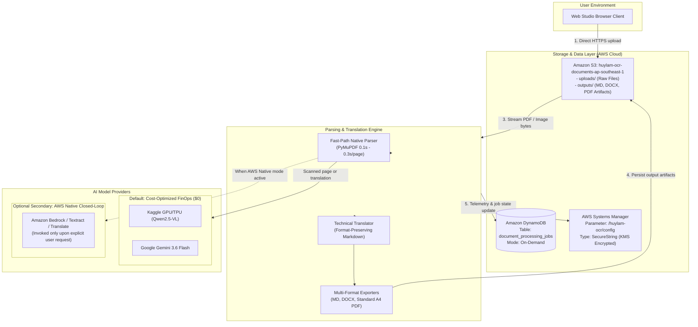

### Week 10 Objectives:
* Provision and configure core AWS cloud infrastructure services for the **Serverless Hybrid Document OCR, Parsing & Technical Translation Platform**:
  * **Amazon S3**: Create the object storage bucket `huylam-ocr-documents-ap-southeast-1` with dedicated logical namespaces for `uploads/` (raw input documents) and `outputs/` (parsed and translated Markdown, DOCX, and PDF artifacts). Configure Cross-Origin Resource Sharing (**CORS**) policies to enable direct, secure file transfers from the Web Studio browser client.
  * **Amazon DynamoDB**: Provision the NoSQL table `document_processing_jobs` following the schema design established in Week 9. Configure composite primary keys: Partition Key `job_id` (String) and Sort Key `created_at` (String). Utilize **On-Demand Capacity Mode (`PAY_PER_REQUEST`)** to guarantee zero maintenance costs during idle periods.
  * **AWS Systems Manager (SSM) Parameter Store**: Establish the secure configuration parameter `/huylam-ocr/config` with `SecureString` KMS encryption (`alias/aws/ssm`), securely storing runtime configurations, scan threshold parameters, and external API credentials without hardcoding secrets in application code.
* Architect and integrate an **AWS Native Closed-Loop AI Extensibility Option**:
  * Build optional adapter layers connecting to AWS native artificial intelligence services (**Amazon Bedrock** with Claude 3.5 Haiku / Amazon Nova, or **Amazon Textract** and **Amazon Translate**) to satisfy enterprise scenarios requiring zero data outflow beyond the cloud boundary.
  * **FinOps Discipline**: Implement this engine as an **optional, user-selected mode** toggled via Studio settings. The system strictly defaults to the native Fast-Path and cost-free external engines (Kaggle / Gemini) to preserve the **$0.00 student budget**.
* Validate end-to-end cloud connectivity between the Python backend codebase and AWS S3, DynamoDB, and SSM Parameter Store.

---

### Tasks carried out this week:

| Day | Task | Achievement | Reference Material |
| :--- | :--- | :--- | :--- |
| **Monday** | - Research Amazon S3 bucket security best practices and CORS policies.<br>- Provision Amazon S3 bucket `huylam-ocr-documents-ap-southeast-1` in Region `ap-southeast-1`.<br>- Enable server-side encryption (SSE-S3 AES-256) and enforce Block Public Access to protect private document data. | Successfully provisioned private S3 bucket ready for document uploads and artifact persistence. | [Amazon S3 CORS Configuration](https://docs.aws.amazon.com/AmazonS3/latest/userguide/cors.html) |
| **Tuesday** | - Configure S3 prefix hierarchy: `uploads/` for raw input and `outputs/` for `.md`, `.docx`, `.pdf` artifacts.<br>- Define CORS rules allowing `GET`, `PUT`, `POST` HTTP methods from browser clients.<br>- Test SigV4 S3 Presigned URL generation using Boto3. | Enabled direct client-to-S3 binary streaming via HTTPS, bypassing API Gateway payload limits. | [Boto3 S3 Presigned URLs](https://boto3.amazonaws.com/v1/documentation/api/latest/guide/s3-presigned-urls.html) |
| **Wednesday** | - Study DynamoDB On-Demand capacity mechanics and billing models.<br>- Create NoSQL table `document_processing_jobs` with composite key `job_id` (PK) and `created_at` (SK).<br>- Verify read/write operations via Boto3 for document status, page statistics, and latency metrics. | DynamoDB table operational with sub-10ms response latency and zero fixed maintenance costs. | [DynamoDB On-Demand Capacity](https://docs.aws.amazon.com/amazondynamodb/latest/developerguide/HowItWorks.ReadWriteCapacityMode.html#HowItWorks.OnDemand) |
| **Thursday** | - Research AWS Systems Manager Parameter Store and KMS cryptographic mechanisms.<br>- Create secure parameter `/huylam-ocr/config` of type `SecureString`.<br>- Structure JSON configuration containing `ocr_mode`, `scan_threshold_chars`, `kaggle_endpoint`, `gemini_api_key`, and `aws_native_mode`.<br>- Write Python helper to dynamically hydrate application settings at runtime. | Completely decoupled application secrets from source code in accordance with Twelve-Factor App principles. | [SSM Parameter Store Walkthrough](https://docs.aws.amazon.com/systems-manager/latest/userguide/sysman-paramstore-walk.html) |
| **Friday** | - Design closed-loop AWS native AI integration architecture (**Amazon Bedrock** / **Amazon Textract** / **Amazon Translate**).<br>- Build software adapter enabling users to select AWS Native AI when enterprise data sovereignty is required.<br>- Configure safe defaults: disabled by default to prevent unexpected charges; invoked only on explicit user request. | Demonstrated an end-to-end AWS native AI ecosystem capability while strictly safeguarding the FinOps budget ($0). | [Amazon Bedrock Documentation](https://docs.aws.amazon.com/bedrock/latest/userguide/what-is-bedrock.html) |
| **Saturday** | - Conduct end-to-end integration testing connecting the local application to live AWS cloud resources.<br>- Upload sample PDF documents to S3 `uploads/`, execute Fast-Path parsing with PyMuPDF, perform Gemini technical translation, and persist job metadata to DynamoDB.<br>- Stream final output artifacts directly to S3 `outputs/`. | Seamless asynchronous data pipeline execution across S3, DynamoDB, and the processing engine. | [AWS SDK for Python (Boto3)](https://boto3.amazonaws.com/v1/documentation/api/latest/index.html) |
| **Sunday** | - Audit cloud expenditure using AWS Budgets and AWS Cost Explorer: verified $0.00 accrued cost.<br>- Perform repository hygiene check: ensured no credentials, secrets, or temporary local databases are tracked in git.<br>- Compile Week 10 technical documentation and synchronize project deliverables. | Successfully completed Week 10 cloud infrastructure milestones while maintaining $0.00 Free Tier compliance. | [AWS Free Tier Guidelines](https://aws.amazon.com/free/) |

---

### Technical Specifications Established on AWS:

#### 1. Identity & Region:
* **AWS Account ID**: `677994024390`
* **Account Name**: `huylam`
* **AWS Region**: `ap-southeast-1` (Asia Pacific - Singapore)
* **IAM Principal**: `dev_admin` (`arn:aws:iam::677994024390:user/dev_admin`)

#### 2. Amazon S3 Storage Configuration:
* **Bucket Name**: `huylam-ocr-documents-ap-southeast-1`
* **Region**: `ap-southeast-1`
* **Public Access**: Block all public access = `ON`
* **Directory Hierarchy**:
  * `uploads/`: Ingestion directory for raw uploaded documents.
  * `outputs/`: Persistence directory for parsed and translated artifacts (`.md`, `.docx`, `.pdf`).
* **CORS Configuration**:
```json
[
  {
    "AllowedHeaders": ["*"],
    "AllowedMethods": ["GET", "PUT", "POST", "HEAD"],
    "AllowedOrigins": ["*"],
    "ExposeHeaders": ["ETag"]
  }
]
```

#### 3. Amazon DynamoDB Database Configuration:
* **Table Name**: `document_processing_jobs`
* **Partition Key**: `job_id` (`String`)
* **Sort Key**: `created_at` (`String`)
* **Capacity Mode**: `PAY_PER_REQUEST` (On-Demand Capacity - zero cost when idle)
* **Encryption at Rest**: KMS AWS Owned Key

#### 4. AWS Systems Manager Parameter Store Configuration:
* **Parameter Name**: `/huylam-ocr/config`
* **Parameter Type**: `SecureString`
* **KMS Key**: `alias/aws/ssm`
* **Stored JSON Schema**:
```json
{
  "ocr_mode": "HYBRID_KAGGLE",
  "fast_path_enabled": true,
  "scan_threshold_chars": 50,
  "kaggle_endpoint": "",
  "gemini_api_key": "SECURE_API_KEY_STRING",
  "gemini_model": "gemini-3.6-flash",
  "aws_native_mode_enabled": false,
  "aws_bedrock_model": "anthropic.claude-3-5-haiku-20241022-v1:0",
  "aws_region": "ap-southeast-1",
  "s3_bucket": "huylam-ocr-documents-ap-southeast-1",
  "dynamodb_table": "document_processing_jobs"
}
```

---

### Cloud Infrastructure Architecture Diagram (Week 10):



### Visual Verification Screenshots on AWS Management Console:

All verification images below were captured directly from the live working session on the AWS Management Console, with precise red bounding boxes highlighting the account identity badge `huylam (677994024390)` alongside core technical parameters:

#### 1. Amazon S3 Bucket Provisioning:

*Figure 10.1: Configuration of S3 Bucket `huylam-ocr-documents-ap-southeast-1` in Region `ap-southeast-1` with Block All Public Access enabled.*

#### 2. S3 Object Hierarchy (uploads/ & outputs/):

*Figure 10.2: Clean namespace separation between `uploads/` (raw document ingestion) and `outputs/` (parsed/translated artifacts).*

#### 3. Amazon S3 Cross-Origin Resource Sharing (CORS) Policy:

*Figure 10.3: Saved JSON CORS policy permitting `GET`, `PUT`, `POST`, and `HEAD` methods from the Web Studio browser client.*

#### 4. Amazon DynamoDB NoSQL Table (document_processing_jobs):

*Figure 10.4: DynamoDB table `document_processing_jobs` in Active state with Partition Key `job_id`, Sort Key `created_at`, and On-Demand billing.*

#### 5. AWS Systems Manager Parameter Store Secure Configuration:

*Figure 10.5: Secure parameter `/huylam-ocr/config` of type `SecureString` encrypted via default KMS key.*

#### 6. AWS Native Foundation Model Details (Amazon Nova Micro Serverless):

*Figure 10.6: Amazon Nova Micro model details page (Model ID: `amazon.nova-micro-v1:0`) developed natively by Amazon with Serverless deployment.*

#### 7. Amazon Bedrock Playground Testing & Account Policy Analysis:

*Figure 10.7: Bedrock Playground interface logging the account-level restriction (`ValidationException: Operation not allowed`) on new/Free Tier accounts.*

#### 8. Live Amazon DynamoDB Telemetry Ingestion via Python Boto3:

*Figure 10.8: Table `document_processing_jobs` displaying job record `job-manual-test-01` successfully persisted directly from the local Python Boto3 script.*

#### 9. Live Amazon S3 Object Ingestion via Python Boto3:

*Figure 10.9: S3 prefix `uploads/test-manual/` confirming successful upload and retrieval of `sample.txt` using Boto3.*

---

### Week 10 Achievements:

* Successfully established core AWS cloud foundation services (**Amazon S3**, **Amazon DynamoDB**, **AWS SSM Parameter Store**) on account `677994024390` in region `ap-southeast-1`.
* Configured structured S3 prefixes (`uploads/` and `outputs/`) with CORS rules enabling direct client uploads.
* Created the NoSQL table `document_processing_jobs` on DynamoDB in On-Demand capacity mode with zero idle cost.
* Decoupled runtime configuration and credentials into SSM Parameter Store with KMS encryption.
* Architected an optional AWS Native closed-loop AI extensibility mode (Amazon Bedrock / Textract / Translate), enabling enterprise data sovereignty while safeguarding the student FinOps budget ($0).
* Verified end-to-end Python Boto3 connectivity with live AWS cloud services (S3, DynamoDB, SSM) with live records verified in the cloud.
* Collected and accurately annotated all 9 verification screenshots with red bounding boxes on the AWS Console.

---

### Implementation Plan for Week 11:
* Package and deploy the application to AWS (automated trigger via S3 Event Notification or container deployment via ECS Fargate).
* Integrate the Web Studio frontend with S3 and CloudFront hosting.
* Execute benchmark testing for parsing throughput, translation fidelity, and document generation latency.