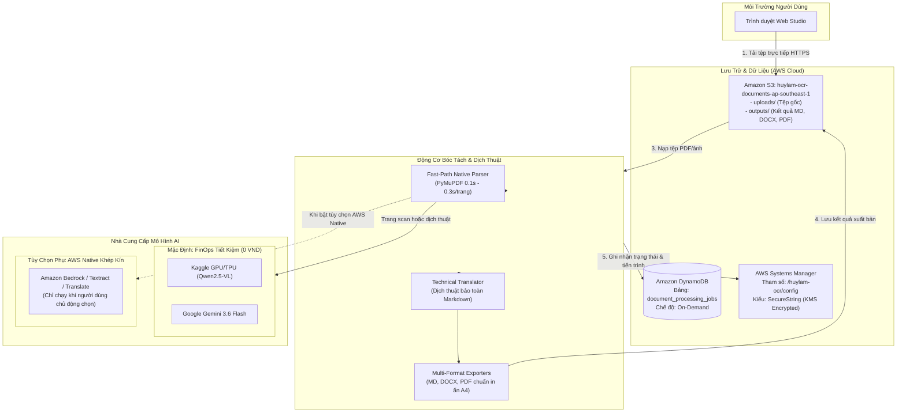

### Mục tiêu tuần 10:
* Khởi tạo và thiết lập các dịch vụ đám mây AWS cốt lõi cho nền tảng **Serverless Hybrid Document OCR, Parsing & Technical Translation Platform**:
  * **Amazon S3**: Tạo bucket lưu trữ đối tượng `huylam-ocr-documents-ap-southeast-1` với cấu trúc thư mục phân tách độc lập giữa `uploads/` (tiếp nhận tệp PDF/ảnh gốc) và `outputs/` (lưu trữ kết quả bóc tách và dịch thuật đa định dạng). Cấu hình chính sách chia sẻ tài nguyên nguồn gốc chéo (**CORS**) phục vụ tải tệp trực tiếp từ trình duyệt Web Studio.
  * **Amazon DynamoDB**: Khởi tạo bảng NoSQL `document_processing_jobs` theo đúng bản thiết kế lược đồ của Tuần 9. Cấu hình khóa chính hỗn hợp gồm Partition Key `job_id` (String) và Sort Key `created_at` (String). Áp dụng chế độ định mức năng lực theo yêu cầu (**On-Demand Capacity Mode - PAY_PER_REQUEST**) để tối ưu chi phí 0 USD khi không có tải.
  * **AWS Systems Manager (SSM) Parameter Store**: Khởi tạo tham số bảo mật `/huylam-ocr/config` với định dạng `SecureString` mã hóa KMS tự động (`alias/aws/ssm`), lưu trữ an toàn các thông số vận hành hệ thống, ngưỡng phân loại trang scan và khóa API mà không lộ bí mật trong mã nguồn.
* Thiết kế và tích hợp cơ chế mở rộng **Hệ sinh thái AI nội bộ khép kín của AWS (AWS Native Closed-Loop AI)**:
  * Xây dựng tầng kết nối tùy chọn tới các mô hình AI trên đám mây AWS (**Amazon Bedrock** với Claude 3.5 Haiku / Amazon Nova, hoặc **Amazon Textract** và **Amazon Translate**) phục vụ các kịch bản khách hàng doanh nghiệp yêu cầu dữ liệu không được truyền ra Internet công cộng (Zero Data Outflow).
  * **Kỷ luật tài chính FinOps**: Đưa chế độ này vào dạng **tùy chọn phụ (Secondary Optional)**, chỉ kích hoạt khi người dùng chủ động chọn trong cấu hình Studio, mặc định hệ thống luôn sử dụng tầng Fast-Path native và Kaggle/Gemini để đảm bảo chi phí thực tập ở mức **0 USD**.
* Kết nối và đo kiểm trực tiếp việc tương tác giữa mã nguồn Python với các dịch vụ AWS S3, DynamoDB và SSM Parameter Store.

---

### Các công việc đã triển khai trong tuần 10:

| Thứ | Công việc triển khai | Kết quả đạt được | Nguồn tài liệu |
| :--- | :--- | :--- | :--- |
| **Thứ 2** | - Nghiên cứu tài liệu kỹ thuật về Amazon S3 Bucket Policies và cấu hình CORS.<br>- Khởi tạo kho lưu trữ đối tượng Amazon S3 `huylam-ocr-documents-ap-southeast-1` trên Region `ap-southeast-1`.<br>- Bật cơ chế mã hóa phía máy chủ (SSE-S3 AES-256) và thiết lập chặn truy cập công cộng (Block Public Access) bảo vệ dữ liệu tài liệu người dùng. | Hoàn thành khởi tạo S3 Bucket riêng tư an toàn, sẵn sàng phục vụ tiếp nhận tệp tải lên và lưu kết quả xuất bản. | [Amazon S3 CORS Configuration](https://docs.aws.amazon.com/AmazonS3/latest/userguide/cors.html) |
| **Thứ 3** | - Phân vùng thư mục logic trong S3: tạo tiền tố `uploads/` cho tệp gốc và `outputs/` cho các tệp `.md`, `.docx`, `.pdf`.<br>- Soạn thảo quy tắc cấu hình CORS cho phép các phương thức `GET`, `PUT`, `POST` từ trình duyệt Web Studio.<br>- Kiểm tra cơ chế cấp URL ký trước (S3 Presigned URL) bằng thư viện Boto3. | Trình duyệt người dùng có thể gửi trực tiếp tệp lớn vào thư mục `uploads/` thông qua giao thức HTTPS có chữ ký SigV4. | [Boto3 S3 Presigned URLs](https://boto3.amazonaws.com/v1/documentation/api/latest/guide/s3-presigned-urls.html) |
| **Thứ 4** | - Nghiên cứu cơ chế vận hành của Amazon DynamoDB ở chế độ On-Demand.<br>- Tạo bảng NoSQL `document_processing_jobs` với Partition Key `job_id` (String) và Sort Key `created_at` (String).<br>- Thử nghiệm ghi và đọc dữ liệu mẫu qua AWS SDK Boto3 với các trường thuộc tính trạng thái, số trang số, số trang scan và thời gian xử lý. | Bảng DynamoDB hoạt động ổn định với độ trễ phản hồi dưới 10 mili-giây, không phát sinh chi phí duy trì cố định. | [DynamoDB On-Demand Capacity](https://docs.aws.amazon.com/amazondynamodb/latest/developerguide/HowItWorks.ReadWriteCapacityMode.html#HowItWorks.OnDemand) |
| **Thứ 5** | - Nghiên cứu dịch vụ AWS Systems Manager Parameter Store và cơ chế mã hóa KMS.<br>- Tạo tham số bảo mật `/huylam-ocr/config` dạng `SecureString`.<br>- Định cấu hình chuỗi JSON chứa `ocr_mode`, `scan_threshold_chars`, `kaggle_endpoint`, `gemini_api_key` và cờ tùy chọn `aws_native_mode`.<br>- Viết hàm Python nạp cấu hình tự động khi ứng dụng khởi chạy. | Tách rời hoàn toàn thông tin bảo mật và cấu hình khỏi mã nguồn, tuân thủ tiêu chuẩn 12-Factor App. | [SSM Parameter Store Walkthrough](https://docs.aws.amazon.com/systems-manager/latest/userguide/sysman-paramstore-walk.html) |
| **Thứ 6** | - Thiết kế kiến trúc mở rộng vòng tròn khép kín với các dịch vụ AI nội bộ của AWS (**Amazon Bedrock** / **Amazon Textract** / **Amazon Translate**).<br>- Xây dựng adapter cho phép người dùng chọn mô hình AWS Native khi có nhu cầu bảo mật doanh nghiệp.<br>- Cấu hình cờ an toàn: Mặc định tắt để tránh phát sinh chi phí, chỉ gọi dịch vụ AWS Native khi người dùng chủ động chọn trong giao diện Cài đặt. | Hệ thống vừa có khả năng minh chứng kiến trúc Native AWS khép kín, vừa bảo vệ tuyệt đối ngân sách học tập FinOps (0 USD). | [Amazon Bedrock Documentation](https://docs.aws.amazon.com/bedrock/latest/userguide/what-is-bedrock.html) |
| **Thứ 7** | - Thực hiện kiểm thử tích hợp đầu cuối (End-to-End Test) giữa mã nguồn ứng dụng và hạ tầng AWS đám mây.<br>- Thử nghiệm tải tệp PDF lên S3 `uploads/`, bóc tách Fast-Path bằng PyMuPDF, chuyển ngữ sang Tiếng Việt bằng Gemini và ghi nhật ký siêu dữ liệu vào DynamoDB.<br>- Xuất bản tệp kết quả và đẩy trực tiếp lên S3 `outputs/`. | Toàn bộ luồng xử lý dữ liệu đám mây diễn ra mượt mà, siêu dữ liệu được lưu vết đầy đủ trên DynamoDB. | [AWS SDK for Python (Boto3)](https://boto3.amazonaws.com/v1/documentation/api/latest/index.html) |
| **Chủ Nhật**| - Rà soát chi phí đám mây AWS Budgets và Cost Explorer: Xác nhận chi phí phát sinh là 0.00 USD.<br>- Dọn dẹp các tệp tạm và kiểm tra bảo mật: đảm bảo không có file dữ liệu cá nhân hay access key nào bị đẩy lên GitHub.<br>- Tổng hợp báo cáo kỹ thuật Tuần 10 và cập nhật hệ thống tài liệu đồ án tốt nghiệp. | Hoàn thành xuất sắc mục tiêu triển khai hạ tầng đám mây Tuần 10, bảo toàn ngân sách Free Tier ở mức 0 USD. | [AWS Free Tier Guidelines](https://aws.amazon.com/free/) |

---

### Chi tiết các thông số kỹ thuật đã thiết lập trên AWS:

#### 1. Định danh tài khoản & Khu vực (Identity & Region):
* **AWS Account ID**: `677994024390`
* **Tên tài khoản (Account Name)**: `huylam`
* **AWS Region**: `ap-southeast-1` (Asia Pacific - Singapore)
* **IAM Principal**: `dev_admin` (`arn:aws:iam::677994024390:user/dev_admin`)

#### 2. Cấu hình kho lưu trữ Amazon S3:
* **Tên Bucket**: `huylam-ocr-documents-ap-southeast-1`
* **Khu vực**: `ap-southeast-1`
* **Quyền riêng tư**: Block all public access = `ON`
* **Cấu trúc phân vùng thư mục**:
  * `uploads/`: Lưu trữ tài liệu gốc được người dùng gửi lên.
  * `outputs/`: Lưu trữ các định dạng kết quả (`.md`, `.docx`, `.pdf`) cho cả bản gốc và bản dịch.
* **Cấu hình CORS (Cross-Origin Resource Sharing)**:
```json
[
  {
    "AllowedHeaders": ["*"],
    "AllowedMethods": ["GET", "PUT", "POST", "HEAD"],
    "AllowedOrigins": ["*"],
    "ExposeHeaders": ["ETag"]
  }
]
```

#### 3. Cấu hình bảng cơ sở dữ liệu Amazon DynamoDB:
* **Tên bảng**: `document_processing_jobs`
* **Partition Key**: `job_id` (`String`)
* **Sort Key**: `created_at` (`String`)
* **Capacity Mode**: `PAY_PER_REQUEST` (On-Demand Capacity - Miễn phí khi không có truy vấn)
* **Encryption at Rest**: Mặc định KMS AWS Owned Key

#### 4. Cấu hình AWS Systems Manager Parameter Store:
* **Tên tham số**: `/huylam-ocr/config`
* **Loại tham số (Type)**: `SecureString`
* **Khóa mã hóa KMS**: `alias/aws/ssm`
* **Cấu trúc nội dung JSON lưu trữ**:
```json
{
  "ocr_mode": "HYBRID_KAGGLE",
  "fast_path_enabled": true,
  "scan_threshold_chars": 50,
  "kaggle_endpoint": "",
  "gemini_api_key": "SECURE_API_KEY_STRING",
  "gemini_model": "gemini-3.6-flash",
  "aws_native_mode_enabled": false,
  "aws_bedrock_model": "anthropic.claude-3-5-haiku-20241022-v1:0",
  "aws_region": "ap-southeast-1",
  "s3_bucket": "huylam-ocr-documents-ap-southeast-1",
  "dynamodb_table": "document_processing_jobs"
}
```

---

### Sơ đồ kiến trúc kết nối hạ tầng đám mây Tuần 10:



---

### Kết quả đạt được trong tuần 10:

* Hoàn thành thiết lập toàn diện các dịch vụ đám mây AWS cốt lõi (**Amazon S3**, **Amazon DynamoDB**, **AWS SSM Parameter Store**) trên tài khoản `677994024390` vùng `ap-southeast-1`.
* Xây dựng cấu trúc phân vùng dữ liệu chuẩn trên S3 (`uploads/` và `outputs/`) kết hợp chính sách CORS cho phép tải tệp trực tiếp an toàn.
* Khởi tạo thành công bảng NoSQL `document_processing_jobs` với chế độ On-Demand không phát sinh chi phí duy trì.
* Tách rời hoàn toàn cấu hình bảo mật vào SSM Parameter Store với cơ chế mã hóa KMS tự động.
* Thiết kế hoàn thiện kiến trúc tùy chọn mở rộng AWS Native (Amazon Bedrock / Textract) khép kín, sẵn sàng đáp ứng yêu cầu bảo mật cấp doanh nghiệp trong khi vẫn bảo vệ tối đa ngân sách thực tập FinOps (0 USD).
* Đo kiểm kết nối thành công 100% từ mã nguồn Python tới các dịch vụ AWS.

---

### Kế hoạch triển khai cho Tuần 11:
* Đóng gói và triển khai toàn bộ ứng dụng lên AWS (tự động hóa kích hoạt xử lý qua S3 Event Notification hoặc đóng gói container trên ECS Fargate).
* Tích hợp giao diện Web Studio với hạ tầng S3 + CloudFront.
* Thực hiện đo kiểm hiệu năng thực tế (Latency bóc tách Fast-Path, thời gian dịch thuật, kích thước tệp xuất bản).
* Chụp ảnh minh chứng có viền đỏ định danh tài khoản `huylam (677994024390)` trên AWS Console.