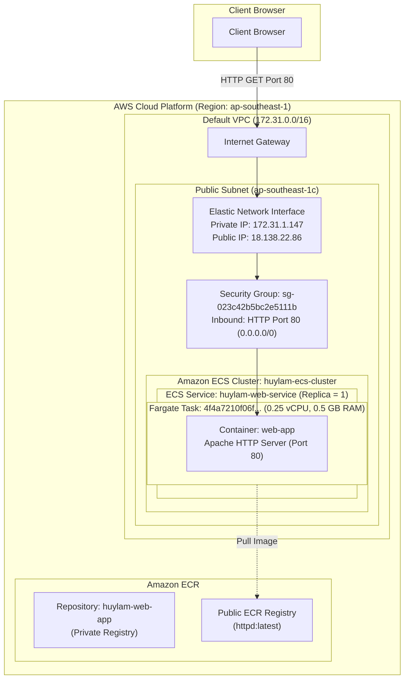

> [!NOTE] Execution Timeline
> **From 21/09/2026 to 27/09/2026**

### Week 8 Objectives:
* Research and master application-level virtualization (**Containerization**) and container management (**Container Orchestration**) on AWS using **Amazon Elastic Container Registry (ECR)** and **Amazon Elastic Container Service (ECS)**.
* Create and manage a private container repository (**Private ECR Repository**) named `huylam-web-app` in the `ap-southeast-1` region, understanding image lifecycle policies, repository security, and standard CLI commands (`docker push` / `docker pull`).
* Provision a container orchestration cluster (**Amazon ECS Cluster**) named `huylam-ecs-cluster`, utilizing serverless compute (**AWS Fargate**) to completely remove the overhead of provisioning and maintaining underlying EC2 instances.
* Author an ECS Task Definition blueprint (`huylam-web-task:1`), optimizing resource allocation to minimal tier (0.25 vCPU, 0.5 GB RAM) eligible for AWS Free Tier, running an Apache Web Server container (`public.ecr.aws/docker/library/httpd:latest`) exposing container port 80.
* Deploy and maintain an application service (**ECS Service**) named `huylam-web-service` configured with `REPLICA` scheduling strategy, ensuring `1` running task is constantly healthy across default AWS VPC subnets.
* Configure `awsvpc` network mode, assigning an Elastic Network Interface (ENI) and a public IPv4 address (`18.138.22.86`), opening inbound port 80 on Security Group `sg-023c42b5bc2e5111b`.
* Perform live browser verification of the containerized web server across the public Internet, validating `HTTP 200 OK` response and the standard message `It works!`.
* Study continuous integration and continuous delivery (**CI/CD**) principles using **AWS CodePipeline** and GitHub source control integration.
* Uphold strict cloud financial discipline (**FinOps**): Execute a complete teardown procedure, setting desired task count to 0, deleting the ECS Service, ECS Cluster, Task Definition, and ECR Repository to maintain a total cost of $0.00 USD.

---

### Tasks Completed in Week 8:

| Day | Task | Key Outcome | References |
| :--- | :--- | :--- | :--- |
| **Monday (21/09/2026)** | - Study containerization concepts and Docker technology.<br>- Compare containers with traditional virtual machines: kernel sharing, lightweight footprint, instantaneous startup.<br>- Explore container image storage on Amazon ECR. | Mastered OCI image architecture, registries, repositories, and IAM permission policies for ECR. | [Amazon ECR Concepts](https://docs.aws.amazon.com/AmazonECR/latest/userguide/what-is-ecr.html) |
| **Tuesday (22/09/2026)** | - Create private Amazon ECR repository `huylam-web-app` in region `ap-southeast-1`.<br>- Analyze docker push workflow: authentication via AWS CLI ECR Get-Login-Password, tagging, and pushing images. | Completed repository setup, prepared for application Docker image storage. | [Creating ECR Repository](https://docs.aws.amazon.com/AmazonECR/latest/userguide/repository-create.html) |
| **Wednesday (23/09/2026)** | - Study Amazon Elastic Container Service (ECS) architecture.<br>- Compare EC2 launch type versus serverless AWS Fargate.<br>- Verify activation of IAM service-linked role `AWSServiceRoleForECS`. | Selected AWS Fargate architecture to eliminate infrastructure management and minimize operational costs. | [Amazon ECS Launch Types](https://docs.aws.amazon.com/AmazonECS/latest/developerguide/launch_types.html) |
| **Thursday (24/09/2026)** | - Provision Amazon ECS Cluster `huylam-ecs-cluster` supporting Fargate and Fargate Spot.<br>- Author ECS Task Definition `huylam-web-task` (0.25 vCPU, 0.5 GB RAM).<br>- Configure container `web-app` with Apache image `httpd:latest` from AWS Public ECR, opening port 80. | Successfully registered Task Definition revision `huylam-web-task:1` in Active state. | [ECS Task Definitions](https://docs.aws.amazon.com/AmazonECS/latest/developerguide/task_definitions.html) |
| **Friday (25/09/2026)** | - Create ECS Service `huylam-web-service` within cluster `huylam-ecs-cluster`.<br>- Network setup: Default VPC, 3 public subnets, auto-assigned Public IP, Security Group opening HTTP 80.<br>- Configure desired tasks = 1 using Replica strategy. | ECS service successfully provisioned and launched a Fargate container in under 15 seconds. | [Creating ECS Services](https://docs.aws.amazon.com/AmazonECS/latest/developerguide/ecs_services.html) |
| **Saturday (26/09/2026)** | - Monitor task lifecycle (Created -> Provisioning -> Pending -> Running).<br>- Extract Elastic Network Interface `eni-0dcbf8076c9d39691` and Public IPv4 `18.138.22.86`.<br>- Access web server via browser to verify `It works!` message and HTTP 200 OK status. | Successfully verified 100% web application functionality running on serverless Fargate. | [Verifying ECS Tasks](https://docs.aws.amazon.com/AmazonECS/latest/developerguide/task-lifecycle.html) |
| **Sunday** | - Study CI/CD principles: Continuous Integration, Continuous Delivery, and AWS CodePipeline architecture.<br>- Perform FinOps Teardown procedure, deleting all ECS services, tasks, clusters, and ECR repositories.<br>- Compile technical report Lab 000016 and complete Week 8 documentation. | Completed all weekly milestones while maintaining $0.00 USD Free Tier expenditure. | [AWS CodePipeline User Guide](https://docs.aws.amazon.com/codepipeline/latest/userguide/welcome.html) |

---

### Verified Technical Parameters on AWS:

#### 1. Identity & Environment:
* **AWS Account ID**: `677994024390`
* **Account Name**: `huylam`
* **IAM Principal**: `dev_admin` (`arn:aws:iam::677994024390:user/dev_admin`)
* **AWS Region**: `ap-southeast-1` (Asia Pacific - Singapore)
* **Availability Zone**: `ap-southeast-1c`
* **VPC**: Default VPC (`vpc-0c84feaf395ece4dd`)
* **Subnet**: `subnet-0bba3228d80514181` (Public Subnet in AZ `ap-southeast-1c`)
* **Security Group**: `sg-023c42b5bc2e5111b` (default VPC SG, Inbound Rule: TCP 80 from `0.0.0.0/0`, Rule ID: `sgr-046178368b83207ba`)

#### 2. Amazon ECR Repository Details:
* **Repository Name**: `huylam-web-app`
* **Repository ARN**: `arn:aws:ecr:ap-southeast-1:677994024390:repository/huylam-web-app`
* **Repository URI**: `677994024390.dkr.ecr.ap-southeast-1.amazonaws.com/huylam-web-app`
* **Repository Type**: Private
* **Encryption**: AES-256 (Default KMS managed)
* **Tag Immutability**: Disabled
* **Scan on push**: Disabled

#### 3. Amazon ECS Cluster Details:
* **Cluster Name**: `huylam-ecs-cluster`
* **Cluster ARN**: `arn:aws:ecs:ap-southeast-1:677994024390:cluster/huylam-ecs-cluster`
* **Status**: `ACTIVE`
* **Capacity Providers**: `FARGATE`, `FARGATE_SPOT`
* **Default Capacity Provider Strategy**: `FARGATE` (Base = 0, Weight = 1)
* **IAM Service-Linked Role**: `AWSServiceRoleForECS` (`arn:aws:iam::677994024390:role/aws-service-role/ecs.amazonaws.com/AWSServiceRoleForECS`)

#### 4. Amazon ECS Task Definition:
* **Family Name**: `huylam-web-task`
* **Revision**: `1` (`huylam-web-task:1`)
* **Task Definition ARN**: `arn:aws:ecs:ap-southeast-1:677994024390:task-definition/huylam-web-task:1`
* **Compatibility**: `FARGATE`
* **OS / Architecture**: `Linux/X86_64`
* **Resource Allocation**:
  * **vCPU**: `256` (0.25 vCPU)
  * **Memory**: `512` (0.5 GB / 512 MiB)
* **Network Mode**: `awsvpc`
* **Container Details (`web-app`)**:
  * **Container Name**: `web-app`
  * **Image URI**: `public.ecr.aws/docker/library/httpd:latest`
  * **Port Mappings**: Container port `80`, Protocol `TCP`, App Protocol `HTTP`
  * **Essential**: `Yes`
  * **Ephemeral Storage**: 20 GiB

#### 5. Amazon ECS Service:
* **Service Name**: `huylam-web-service`
* **Service ARN**: `arn:aws:ecs:ap-southeast-1:677994024390:service/huylam-ecs-cluster/huylam-web-service`
* **Cluster**: `huylam-ecs-cluster`
* **Compute Option**: `Launch type: FARGATE`
* **Platform Version**: `1.4.0` (LATEST)
* **Scheduling Strategy**: `REPLICA`
* **Desired Tasks**: `1`
* **Deployment Type**: Rolling update (Min healthy percent = 100%, Max percent = 200%)
* **Deployment Circuit Breaker**: Enabled with automated rollback on failure
* **Availability Zone Rebalancing**: Enabled

#### 6. Running ECS Task Instance:
* **Task ID**: `4f4a7210f06f48c2ade4d568bde7967a`
* **Task ARN**: `arn:aws:ecs:ap-southeast-1:677994024390:task/huylam-ecs-cluster/4f4a7210f06f48c2ade4d568bde7967a`
* **Last Status**: `RUNNING`
* **Desired Status**: `RUNNING`
* **Availability Zone**: `ap-southeast-1c`
* **Elastic Network Interface (ENI ID)**: `eni-0dcbf8076c9d39691`
* **Private IP**: `172.31.1.147`
* **Public IP**: `18.138.22.86`
* **Public DNS Name**: `ec2-18-138-22-86.ap-southeast-1.compute.amazonaws.com`
* **Task Lifecycle Timestamps**:
  * Created: 14:57:39 UTC+7
  * Provisioning (ENI Attached): 14:57:42 UTC+7
  * Pending (Image pulled in 8 seconds): 14:57:49 to 14:57:58 UTC+7
  * Running: 14:57:58 UTC+7

#### 7. Web Server Verification:
* **Test URL**: `http://18.138.22.86`
* **HTTP Status Code**: `HTTP/1.1 200 OK`
* **Server Software**: `Apache/2.4.68 (Unix)`
* **Content Type**: `text/html`
* **Displayed Content**: `It works!`

---

### Architecture Diagram: Amazon ECS on AWS Fargate:



---

### Step-by-step Execution and Proof Screenshots:

#### Part 1: Initializing Amazon ECR Repository

1. **Check initial ECR repositories list (Figure 1)**:
   Navigate to Amazon ECR console in Singapore region, confirming an empty repository list.

   
   *Figure 1: Amazon ECR dashboard showing empty repository list and account badge huylam (677994024390).*

2. **Configure ECR repository creation (Figure 2)**:
   Configure repository name `huylam-web-app`, selecting Private visibility and default encryption settings.

   
   *Figure 2: Configuration interface for creating huylam-web-app repository on Amazon ECR.*

3. **Inspect push commands modal (Figure 3)**:
   Repository `huylam-web-app` successfully created; view push commands modal for step-by-step instructions.

   
   *Figure 3: Details of repository huylam-web-app and push command instructions modal.*

---

#### Part 2: Amazon ECS Cluster and Task Definition Configuration

4. **Check initial ECS clusters list (Figure 4)**:
   Open Amazon Elastic Container Service (ECS), confirming no pre-existing clusters (`Clusters (0)`).

   
   *Figure 4: Initial Amazon ECS clusters list showing zero active clusters.*

5. **Create ECS Cluster with AWS Fargate (Figure 5)**:
   Create cluster `huylam-ecs-cluster` using serverless AWS Fargate infrastructure, eliminating underlying EC2 server management.

   
   *Figure 5: ECS Cluster creation interface for huylam-ecs-cluster with AWS Fargate.*

6. **Define ECS Task Definition for Web Server (Figure 6)**:
   Configure task definition `huylam-web-task` with minimal resources (0.25 vCPU, 0.5 GB RAM), adding container `web-app` with Apache image `public.ecr.aws/docker/library/httpd:latest` on port 80.

   
   *Figure 6: Detailed Task Definition configuration for huylam-web-task with web-app container on port 80.*

7. **Verify Task Definition creation (Figure 7)**:
   Initial revision `huylam-web-task:1` registered successfully in **Active** status.

   
   *Figure 7: Successful registration banner for Task Definition huylam-web-task:1 in Active state.*

---

#### Part 3: Deploying ECS Service and Verifying Web Server

8. **Deploy ECS Service `huylam-web-service` (Figure 8)**:
   From task definition view, select **Deploy -> Create service**. Enter service name `huylam-web-service`, choose cluster `huylam-ecs-cluster`, Fargate launch type, desired tasks = 1, default VPC, and enable public IP assignment.

   
   *Figure 8: Deployment configuration for service huylam-web-service on cluster huylam-ecs-cluster.*

9. **Fargate Task orchestration and running status (Figures 9 & 9a)**:
   ECS automatically provisions a Fargate task with ID `4f4a7210f06f48c2ade4d568bde7967a`. The lifecycle progresses smoothly to **RUNNING**.

   
   *Figure 9: Detailed Fargate task view showing RUNNING status and complete task lifecycle.*

   
   *Figure 9a: Task network configuration displaying Public IP 18.138.22.86 and attached ENI.*

10. **Browser verification of Apache Web Server (Figure 10)**:
    Access `http://18.138.22.86` directly in the web browser. The Apache server immediately serves the standard `It works!` page.

    
    *Figure 10: Web browser successfully accessing public IP 18.138.22.86 displaying It works!.*

---

### Understanding CI/CD and AWS CodePipeline:

As part of Week 8 learning objectives, modern DevOps practices rely on key concepts:

#### 1. Continuous Integration and Continuous Delivery (CI/CD):
* **Continuous Integration (CI)**: Automates integrating code changes from multiple contributors into a shared mainline regularly. Every push triggers automated build and testing suites to catch integration issues early.
* **Continuous Delivery (CD)**: Automatically prepares code changes for release to staging or production environments once tests pass, enabling push-button deployments.
* **Continuous Deployment**: Expands on continuous delivery by automatically releasing changes directly to production without human intervention if quality gates pass.

#### 2. AWS CodePipeline Architecture:
AWS CodePipeline is a serverless continuous delivery service:
* **Source Stage**: Detects changes in repositories (GitHub, AWS CodeCommit, or S3).
* **Build Stage**: Executes build scripts via AWS CodeBuild (`buildspec.yml`), compiling code and generating Docker images pushed to Amazon ECR.
* **Deploy Stage**: Deploys updated task definitions directly to Amazon ECS services.

---

### FinOps Teardown Procedure ($0.00 Cost Guarantee):

To maintain $0.00 AWS Free Tier cost, all deployed resources are deleted via AWS CLI:

1. **Scale desired task count to 0**:
   ```bash
   aws ecs update-service \
     --cluster huylam-ecs-cluster \
     --service huylam-web-service \
     --desired-count 0 \
     --region ap-southeast-1
   ```

2. **Delete ECS Service**:
   ```bash
   aws ecs delete-service \
     --cluster huylam-ecs-cluster \
     --service huylam-web-service \
     --region ap-southeast-1
   ```

3. **Delete ECS Cluster**:
   ```bash
   aws ecs delete-cluster \
     --cluster huylam-ecs-cluster \
     --region ap-southeast-1
   ```

4. **Deregister Task Definition**:
   ```bash
   aws ecs deregister-task-definition \
     --task-definition huylam-web-task:1 \
     --region ap-southeast-1
   ```

5. **Delete ECR Repository**:
   ```bash
   aws ecr delete-repository \
     --repository-name huylam-web-app \
     --force \
     --region ap-southeast-1
   ```

6. **Revoke Inbound Port 80 on Default Security Group**:
   ```bash
   aws ec2 revoke-security-group-ingress \
     --group-id sg-023c42b5bc2e5111b \
     --protocol tcp \
     --port 80 \
     --cidr 0.0.0.0/0 \
     --region ap-southeast-1
   ```