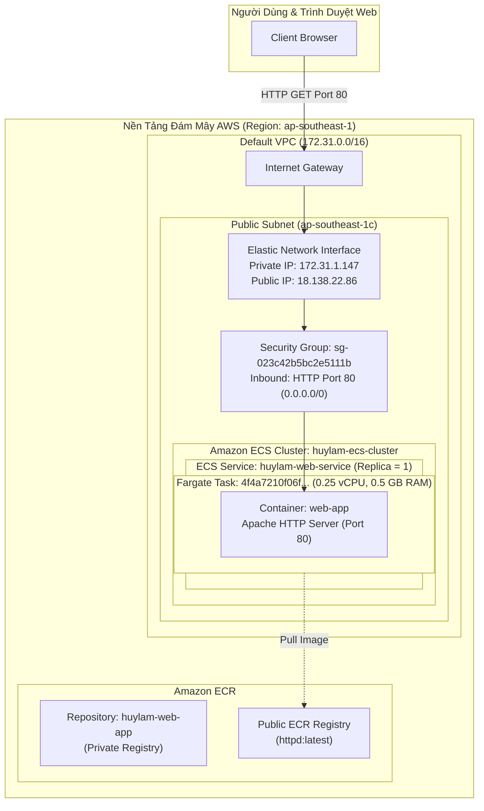

### Mục tiêu tuần 8:
* Nghiên cứu và làm chủ kiến trúc ảo hóa tầng ứng dụng (**Containerization**) và công nghệ điều phối container (**Container Orchestration**) trên nền tảng đám mây AWS thông qua dịch vụ **Amazon Elastic Container Registry (ECR)** và **Amazon Elastic Container Service (ECS)**.
* Khởi tạo và quản trị kho lưu trữ container riêng tư (**Private ECR Repository**) mang tên `huylam-web-app` trên vùng `ap-southeast-1`, tìm hiểu cơ chế quản lý vòng đời image, chính sách bảo mật và bộ lệnh tiêu chuẩn `docker push` / `docker pull`.
* Khởi tạo cụm điều phối container **Amazon ECS Cluster** `huylam-ecs-cluster`, áp dụng mô hình điện toán phi máy chủ (**Serverless Compute - AWS Fargate**) nhằm loại bỏ hoàn toàn gánh nặng vận hành máy chủ EC2 cơ sở.
* Định nghĩa bản thiết kế container (**ECS Task Definition**) `huylam-web-task` (phiên bản `1`), tối ưu hóa định mức tài nguyên tối thiểu (0.25 vCPU, 0.5 GB RAM) đủ điều kiện AWS Free Tier, cấu hình container Apache Web Server (`public.ecr.aws/docker/library/httpd:latest`) mở cổng mạng HTTP 80.
* Khởi tạo dịch vụ duy trì ứng dụng (**ECS Service**) `huylam-web-service` với chiến lược điều phối `REPLICA`, duy trì liên tục `1` Task đang hoạt động trên hệ thống mạng AWS VPC mặc định.
* Cấu hình chế độ mạng `awsvpc`, cấp phát giao diện mạng đàn hồi (ENI) và địa chỉ IP công cộng (Public IP `18.138.22.86`), mở cổng 80 trên nhóm bảo mật Security Group `sg-023c42b5bc2e5111b`.
* Đo kiểm thực tế khả năng phân phối lưu lượng của Web Server qua trình duyệt Internet công cộng, kiểm chứng phản hồi `HTTP 200 OK` và dòng thông điệp tiêu chuẩn `It works!`.
* Tìm hiểu quy trình tích hợp và phân phối liên tục (**CI/CD**) với **AWS CodePipeline** và liên kết mã nguồn GitHub.
* Duy trì kỷ luật tài chính đám mây **FinOps**: Thực hiện quy trình dọn dẹp FinOps Teardown đầy đủ, hạ số lượng desired count về 0, xóa ECS Service, ECS Cluster, Task Definition và ECR Repository để bảo toàn mức chi phí 0 USD.

---

### Các công việc đã triển khai trong tuần 8:

| Thứ | Công việc | Kết quả đạt được | Nguồn tài liệu |
| :--- | :--- | :--- | :--- |
| **Thứ 2** | - Nghiên cứu khái niệm Container và công nghệ Docker.<br>- So sánh Container với Virtual Machine (máy ảo truyền thống): chia sẻ kernel, dung lượng gọn nhẹ, tốc độ khởi động tức thì.<br>- Tìm hiểu kiến trúc lưu trữ container image trên Amazon ECR. | Nắm vững nguyên lý hoạt động của OCI Image, Registry, Repository và cơ chế phân quyền IAM cho ECR. | [Amazon ECR Concepts](https://docs.aws.amazon.com/AmazonECR/latest/userguide/what-is-ecr.html) |
| **Thứ 3** | - Khởi tạo kho lưu trữ container Amazon ECR `huylam-web-app` trên Region `ap-southeast-1`.<br>- Phân tích bộ lệnh đẩy container: đăng nhập qua AWS CLI ECR Get-Login-Password, gắn thẻ `docker tag` và đẩy `docker push`. | Hoàn thành cấu hình kho lưu trữ, sẵn sàng tiếp nhận Docker images của dự án. | [Creating ECR Repository](https://docs.aws.amazon.com/AmazonECR/latest/userguide/repository-create.html) |
| **Thứ 4** | - Nghiên cứu kiến trúc Amazon Elastic Container Service (ECS).<br>- Phân biệt hai mô hình tính toán: EC2 Launch Type và AWS Fargate (Serverless).<br>- Kích hoạt vai trò liên kết dịch vụ hệ thống `AWSServiceRoleForECS`. | Lựa chọn kiến trúc AWS Fargate để tối ưu chi phí vận hành và loại bỏ việc quản trị hạ tầng máy chủ nền. | [Amazon ECS Launch Types](https://docs.aws.amazon.com/AmazonECS/latest/developerguide/launch_types.html) |
| **Thứ 5** | - Khởi tạo cụm Amazon ECS Cluster `huylam-ecs-cluster` hỗ trợ Fargate và Fargate Spot.<br>- Soạn thảo bản mô tả container ECS Task Definition `huylam-web-task` (0.25 vCPU, 0.5 GB RAM).<br>- Cấu hình container `web-app` sử dụng image Apache `httpd:latest` từ AWS Public ECR, mở cổng 80. | Đăng ký thành công Task Definition phiên bản `huylam-web-task:1` ở trạng thái Active. | [ECS Task Definitions](https://docs.aws.amazon.com/AmazonECS/latest/developerguide/task_definitions.html) |
| **Thứ 6** | - Khởi tạo dịch vụ ECS Service `huylam-web-service` thuộc cụm `huylam-ecs-cluster`.<br>- Cấu hình mạng: Default VPC, 3 public subnets, cấp phát Public IP tự động, Security Group mở port 80 HTTP.<br>- Thiết lập số lượng tác vụ mong muốn (Desired tasks = 1) theo chiến lược Replica. | ECS Service điều phối khởi chạy thành công container Fargate trong vòng 15 giây. | [Creating ECS Services](https://docs.aws.amazon.com/AmazonECS/latest/developerguide/ecs_services.html) |
| **Thứ 7** | - Giám sát vòng đời Task (Created -> Provisioning -> Pending -> Running).<br>- Trích xuất Elastic Network Interface `eni-0dcbf8076c9d39691` và địa chỉ Public IPv4 `18.138.22.86`.<br>- Truy cập website qua trình duyệt xác thực dòng chữ `It works!` và đo kiểm phản hồi HTTP 200 OK. | Xác thực thành công 100% ứng dụng container webserver hoạt động ổn định trên hạ tầng Fargate. | [Verifying ECS Tasks](https://docs.aws.amazon.com/AmazonECS/latest/developerguide/task-lifecycle.html) |
| **Chủ Nhật**| - Tìm hiểu các khái niệm CI/CD: Continuous Integration, Continuous Delivery và dịch vụ AWS CodePipeline.<br>- Thực hiện quy trình FinOps Teardown dọn dẹp sạch toàn bộ tài nguyên ECS Service, Task, Cluster và ECR Repository.<br>- Tổng hợp báo cáo kỹ thuật Lab 000016 và cập nhật tài liệu Worklog Tuần 8. | Hoàn thành toàn diện mục tiêu học tập Tuần 8, duy trì chi phí AWS Free Tier ở mức 0 USD. | [AWS CodePipeline User Guide](https://docs.aws.amazon.com/codepipeline/latest/userguide/welcome.html) |

---

### Chi tiết các thông số kỹ thuật đã xác thực trên AWS:

#### 1. Định danh tài khoản & Khu vực (Identity & Region):
* **AWS Account ID**: `677994024390`
* **Tên tài khoản (Account Name)**: `huylam`
* **IAM Principal**: `dev_admin` (`arn:aws:iam::677994024390:user/dev_admin`)
* **AWS Region**: `ap-southeast-1` (Asia Pacific - Singapore)
* **Availability Zone**: `ap-southeast-1c`
* **VPC trực thuộc**: Default VPC (`vpc-0c84feaf395ece4dd`)
* **Subnet thực thi**: `subnet-0bba3228d80514181` (Public Subnet tại AZ `ap-southeast-1c`)
* **Nhóm bảo mật (Security Group)**: `sg-023c42b5bc2e5111b` (default VPC SG, Inbound Rule: TCP 80 từ `0.0.0.0/0`, Security Group Rule ID: `sgr-046178368b83207ba`)

#### 2. Thông số kho lưu trữ container (Amazon ECR Repository):
* **Tên kho (Repository Name)**: `huylam-web-app`
* **Repository ARN**: `arn:aws:ecr:ap-southeast-1:677994024390:repository/huylam-web-app`
* **Repository URI**: `677994024390.dkr.ecr.ap-southeast-1.amazonaws.com/huylam-web-app`
* **Loại kho**: Private
* **Cơ chế mã hóa (Encryption)**: AES-256 (Mặc định do AWS KMS quản lý)
* **Tag Immutability**: Disabled (Cho phép ghi đè thẻ image trong quá trình phát triển)
* **Scan on push**: Disabled (Tiết kiệm chi phí quét lỗ hổng bảo mật)

#### 3. Cụm điều phối container (Amazon ECS Cluster):
* **Tên cụm (Cluster Name)**: `huylam-ecs-cluster`
* **Cluster ARN**: `arn:aws:ecs:ap-southeast-1:677994024390:cluster/huylam-ecs-cluster`
* **Trạng thái (Status)**: `ACTIVE`
* **Nhà cung cấp năng lực (Capacity Providers)**: `FARGATE`, `FARGATE_SPOT`
* **Default Capacity Provider Strategy**: `FARGATE` (Base = 0, Weight = 1)
* **IAM Service-Linked Role**: `AWSServiceRoleForECS` (`arn:aws:iam::677994024390:role/aws-service-role/ecs.amazonaws.com/AWSServiceRoleForECS`)

#### 4. Bản mô tả tác vụ (Amazon ECS Task Definition):
* **Family Name**: `huylam-web-task`
* **Revision**: `1` (`huylam-web-task:1`)
* **Task Definition ARN**: `arn:aws:ecs:ap-southeast-1:677994024390:task-definition/huylam-web-task:1`
* **Hạ tầng tương thích (Compatibility)**: `FARGATE`
* **Hệ điều hành / Kiến trúc**: `Linux/X86_64`
* **Định mức tài nguyên cấp phát (Task Size)**:
  * **vCPU**: `256` (0.25 vCPU)
  * **Bộ nhớ RAM**: `512` (0.5 GB / 512 MiB)
* **Chế độ mạng (Network Mode)**: `awsvpc`
* **Cấu hình Container (`web-app`)**:
  * **Tên container**: `web-app`
  * **Image URI**: `public.ecr.aws/docker/library/httpd:latest`
  * **Cổng mở (Port Mappings)**: Cổng container `80`, Protocol `TCP`, App Protocol `HTTP`
  * **Essential**: `Yes`
  * **Dung lượng lưu trữ tạm (Ephemeral Storage)**: 20 GiB

#### 5. Dịch vụ duy trì container (Amazon ECS Service):
* **Tên dịch vụ (Service Name)**: `huylam-web-service`
* **Service ARN**: `arn:aws:ecs:ap-southeast-1:677994024390:service/huylam-ecs-cluster/huylam-web-service`
* **Cụm quản lý**: `huylam-ecs-cluster`
* **Mô hình tính toán**: `Launch type: FARGATE`
* **Phiên bản nền tảng (Platform Version)**: `1.4.0` (LATEST)
* **Chiến lược điều phối (Scheduling Strategy)**: `REPLICA`
* **Số lượng tác vụ mong muốn (Desired tasks)**: `1`
* **Chiến lược triển khai (Deployment Type)**: Rolling update (Min healthy percent = 100%, Max percent = 200%)
* **Deployment Circuit Breaker**: Bật cơ chế tự động rollback khi triển khai thất bại
* **Availability Zone Rebalancing**: Enabled

#### 6. Phiên bản tác vụ thực thi (Running ECS Task Instance):
* **Task ID**: `4f4a7210f06f48c2ade4d568bde7967a`
* **Task ARN**: `arn:aws:ecs:ap-southeast-1:677994024390:task/huylam-ecs-cluster/4f4a7210f06f48c2ade4d568bde7967a`
* **Trạng thái thực thi (Last Status)**: `RUNNING`
* **Trạng thái mong muốn (Desired Status)**: `RUNNING`
* **Khu vực khả dụng (Availability Zone)**: `ap-southeast-1c`
* **Giao diện mạng ảo (ENI ID)**: `eni-0dcbf8076c9d39691`
* **Địa chỉ IPv4 riêng (Private IP)**: `172.31.1.147`
* **Địa chỉ IPv4 công cộng (Public IP)**: `18.138.22.86`
* **Public DNS Name**: `ec2-18-138-22-86.ap-southeast-1.compute.amazonaws.com`
* **Vòng đời tác vụ (Task Lifecycle)**:
  * Khởi tạo (Created): 14:57:39 UTC+7
  * Gắn ENI (Provisioning): 14:57:42 UTC+7
  * Kéo image (Pending): Kéo xong trong 8 giây (14:57:49 đến 14:57:58)
  * Hoàn tất chạy (Running): 14:57:58 UTC+7

#### 7. Đo kiểm phản hồi dịch vụ Web (Web Server Verification):
* **URL kiểm thử**: `http://18.138.22.86`
* **Mã trạng thái phản hồi**: `HTTP/1.1 200 OK`
* **Phần mềm máy chủ (Server)**: `Apache/2.4.68 (Unix)`
* **Loại nội dung (Content-Type)**: `text/html`
* **Nội dung hiển thị trên trang**: `It works!`

---

### Sơ đồ kiến trúc triển khai Amazon ECS Fargate:



---

### Quy trình triển khai thực tế và hình ảnh minh chứng:

#### Phần 1: Khởi tạo Amazon ECR Repository

1. **Kiểm tra danh sách kho lưu trữ ban đầu (Ảnh 1)**:
   Mở bảng điều khiển Amazon ECR tại vùng Singapore, xác nhận trạng thái ban đầu chưa có kho lưu trữ riêng tư nào.

   
   *Hình 1: Bảng điều khiển Amazon ECR hiển thị danh sách kho rỗng cùng huy hiệu tài khoản huylam (677994024390).*

2. **Cấu hình tạo kho lưu trữ ECR `huylam-web-app` (Ảnh 2)**:
   Thiết lập tên kho `huylam-web-app`, đặt loại kho là Private và giữ các cấu hình mã hóa mặc định.

   
   *Hình 2: Giao diện cấu hình tạo kho lưu trữ huylam-web-app trên Amazon ECR.*

3. **Xem hướng dẫn lệnh đẩy image của kho lưu trữ (Ảnh 3)**:
   Kho lưu trữ `huylam-web-app` được tạo thành công, bấm **View push commands** để tra cứu bộ lệnh đẩy Docker image lên kho.

   
   *Hình 3: Chi tiết kho lưu trữ huylam-web-app và hộp thoại hướng dẫn các bước xác thực và đẩy image.*

---

#### Phần 2: Cấu hình cụm Amazon ECS và Task Definition

4. **Kiểm tra danh sách cụm ECS ban đầu (Ảnh 4)**:
   Mở dịch vụ Amazon Elastic Container Service (ECS), xác nhận cụm ban đầu có số lượng là 0 (`Clusters (0)`).

   
   *Hình 4: Danh sách cụm Amazon ECS ban đầu chưa có cụm nào được tạo.*

5. **Khởi tạo ECS Cluster với hạ tầng AWS Fargate (Ảnh 5)**:
   Tạo cụm `huylam-ecs-cluster`, cấu hình hạ tầng phi máy chủ AWS Fargate (serverless) giúp tối ưu hóa chi phí và loại bỏ việc vận hành máy chủ EC2 cơ sở.

   
   *Hình 5: Giao diện khởi tạo cụm huylam-ecs-cluster với lựa chọn năng lực AWS Fargate.*

6. **Định nghĩa ECS Task Definition cho Web Server (Ảnh 6)**:
   Thiết lập bản mô tả tác vụ `huylam-web-task`, chọn mức tài nguyên tối thiểu 0.25 vCPU và 0.5 GB RAM, cấu hình container `web-app` sử dụng image Apache `public.ecr.aws/docker/library/httpd:latest` và mở cổng container 80.

   
   *Hình 6: Cấu hình chi tiết Task Definition huylam-web-task với container web-app mở cổng 80.*

7. **Xác nhận Task Definition tạo thành công (Ảnh 7)**:
   Phiên bản đầu tiên `huylam-web-task:1` đã được đăng ký thành công trên hệ thống và hiển thị trạng thái **Active**.

   
   *Hình 7: Thông báo đăng ký thành công Task Definition huylam-web-task:1 ở trạng thái Active.*

---

#### Phần 3: Triển khai ECS Service và Xác thực Web Server

8. **Cấu hình triển khai ECS Service `huylam-web-service` (Ảnh 8)**:
   Từ trang chi tiết Task Definition, chọn **Deploy -> Create service**. Cấu hình tên dịch vụ `huylam-web-service`, chọn cụm `huylam-ecs-cluster`, mô hình tính toán Fargate, số lượng tác vụ mong muốn là 1, chọn Default VPC và bật tự động cấp phát Public IP.

   
   *Hình 8: Giao diện cấu hình triển khai dịch vụ huylam-web-service trên cụm huylam-ecs-cluster.*

9. **Tác vụ Fargate được điều phối thành công (Ảnh 9 & 9a)**:
   Dịch vụ ECS tự động khởi chạy 1 Task Fargate mang định danh `4f4a7210f06f48c2ade4d568bde7967a`. Vòng đời tác vụ diễn ra suôn sẻ và đạt trạng thái **RUNNING**.

   
   *Hình 9: Chi tiết tác vụ Fargate đang hoạt động ở trạng thái RUNNING và tiến trình vòng đời Task Lifecycle.*

   
   *Hình 9a: Thông tin cấu hình mạng của tác vụ hiển thị địa chỉ Public IP 18.138.22.86 và ENI tương ứng.*

10. **Xác thực Web Server Apache trên trình duyệt Internet (Ảnh 10)**:
    Truy cập trực tiếp địa chỉ `http://18.138.22.86` trên trình duyệt web. Máy chủ web Apache phản hồi tức thì với trang thông báo chuẩn `It works!`.

    
    *Hình 10: Trình duyệt web truy cập thành công địa chỉ IP công khai 18.138.22.86 hiển thị thông điệp It works!.*

---

### Tìm hiểu kiến thức CI/CD và AWS CodePipeline:

Trong khuôn khổ nội dung học tập của Tuần 8, quy trình phát triển và vận hành phần mềm hiện đại dựa trên các trụ cột chính:

#### 1. Khái niệm Tích hợp liên tục và Triển khai liên tục (CI/CD):
* **Continuous Integration (CI)**: Tự động hóa quá trình tích hợp mã nguồn từ nhiều lập trình viên về nhánh chính thường xuyên. Mỗi lần đẩy code (git push) đều kích hoạt tiến trình tự động build và chạy bộ kiểm thử (Unit Tests, Linting) để phát hiện lỗi sớm.
* **Continuous Delivery (CD)**: Đảm bảo mọi thay đổi vượt qua kiểm thử đều sẵn sàng để phát hành lên môi trường Staging hoặc Production bất kỳ lúc nào chỉ bằng một thao tác thủ công.
* **Continuous Deployment**: Mở rộng từ Continuous Delivery, toàn bộ quy trình đẩy mã nguồn lên môi trường Production được tự động hóa 100% mà không cần sự can thiệp thủ công của con người nếu vượt qua toàn bộ các cổng kiểm tra chất lượng.

#### 2. Kiến trúc dịch vụ AWS CodePipeline:
AWS CodePipeline là dịch vụ điều phối luồng phân phối phần mềm theo mô hình serverless:
* **Source Stage**: Lắng nghe và tiếp nhận các sự kiện mã nguồn thay đổi từ GitHub, AWS CodeCommit hoặc Amazon S3.
* **Build Stage**: Sử dụng AWS CodeBuild để kéo mã nguồn, thực thi kịch bản biên dịch trong môi trường container cô lập (`buildspec.yml`), đóng gói artifact và tạo Docker image đẩy lên Amazon ECR.
* **Deploy Stage**: Tự động kích hoạt cập nhật dịch vụ đích như Amazon ECS (cập nhật Task Definition phiên bản mới), AWS Elastic Beanstalk hoặc AWS Lambda.

---

### Quy trình FinOps Teardown dọn dẹp tài nguyên (Chi phí 0 USD):

Sau khi hoàn tất đo kiểm và thu thập đầy đủ bộ ảnh minh chứng thực hành, quy trình thu hồi tài nguyên được thực hiện nghiêm ngặt qua AWS CLI nhằm đảm bảo ngân sách đám mây không phát sinh chi phí:

1. **Cập nhật số lượng Task mong muốn về 0 để dừng container**:
   ```bash
   aws ecs update-service \
     --cluster huylam-ecs-cluster \
     --service huylam-web-service \
     --desired-count 0 \
     --region ap-southeast-1
   ```

2. **Xóa dịch vụ Amazon ECS Service**:
   ```bash
   aws ecs delete-service \
     --cluster huylam-ecs-cluster \
     --service huylam-web-service \
     --region ap-southeast-1
   ```

3. **Xóa cụm Amazon ECS Cluster**:
   ```bash
   aws ecs delete-cluster \
     --cluster huylam-ecs-cluster \
     --region ap-southeast-1
   ```

4. **Hủy kích hoạt (Deregister) Task Definition**:
   ```bash
   aws ecs deregister-task-definition \
     --task-definition huylam-web-task:1 \
     --region ap-southeast-1
   ```

5. **Xóa kho lưu trữ Amazon ECR Repository**:
   ```bash
   aws ecr delete-repository \
     --repository-name huylam-web-app \
     --force \
     --region ap-southeast-1
   ```

6. **Thu hồi quyền truy cập Inbound cổng 80 trên Default Security Group**:
   ```bash
   aws ec2 revoke-security-group-ingress \
     --group-id sg-023c42b5bc2e5111b \
     --protocol tcp \
     --port 80 \
     --cidr 0.0.0.0/0 \
     --region ap-southeast-1
   ```

7. **Xác nhận trạng thái giải phóng 100% tài nguyên**:
   Kiểm tra lại toàn bộ danh sách dịch vụ và cụm, đảm bảo mọi tài nguyên liên quan đã được thu hồi hoàn toàn, đưa mức chi phí duy trì tài nguyên đám mây về đúng mức **0 USD**.