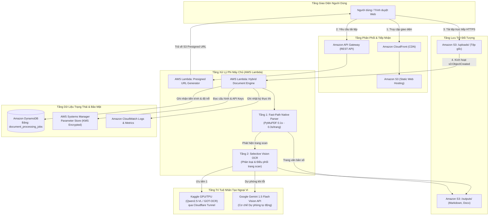

### Mục tiêu tuần 9:
* **Cột mốc chuyển giao chiến lược (Strategic Milestone Transition)**: Hoàn thành toàn diện 8 tuần đào tạo nền tảng hạ tầng đám mây (**Cloud Infrastructure & Container Foundations**), chính thức bước vào Giai đoạn 2 - Triển khai Đề tài tốt nghiệp Capstone: **Serverless Hybrid Document OCR & Parsing Platform on AWS**.
* Nghiên cứu và làm chủ kiến trúc điện toán phi máy chủ (**Serverless Architecture**) trên nền tảng AWS, tìm hiểu chuyên sâu mô hình thực thi hướng sự kiện (**Event-Driven Architecture**) thông qua bộ ba dịch vụ cốt lõi: **AWS Lambda**, **Amazon API Gateway**, và **Amazon DynamoDB**.
* Thực hiện phân tích và so sánh kiến trúc giữa giải pháp điều phối Container (**Amazon ECS Fargate** đã thực hành ở Tuần 8) và giải pháp phi máy chủ (**AWS Lambda** trong đề tài Capstone): Đánh giá tính phù hợp về chi phí vận hành (0 USD khi không có tải), khả năng tự động co giãn tức thì theo từng tệp tài liệu, và tối ưu hóa tài nguyên đám mây.
* Thiết kế bản vẽ kiến trúc tổng thể hệ thống Serverless Microservices cho nền tảng bóc tách tài liệu lai (**Hybrid Document Parsing**):
  * **Tầng tiếp nhận & Giao diện**: Amazon S3 Static Website Hosting kết hợp mạng phân phối nội dung toàn cầu Amazon CloudFront và chứng chỉ SSL/TLS.
  * **Tầng cổng giao tiếp API**: Amazon API Gateway (REST API) cung cấp các endpoint an toàn tiếp nhận yêu cầu bóc tách và tra cứu tiến trình.
  * **Tầng tính toán phi máy chủ (Compute Layer)**: Cụm hàm AWS Lambda đảm nhiệm bóc tách nhanh (Fast-Path Native Parser), sinh URL ký trước (S3 Presigned URL), và điều phối OCR chọn lọc (Hybrid Orchestrator).
  * **Tầng lưu trữ & Dữ liệu**: Amazon S3 lưu trữ tệp gốc và kết quả xuất bản (`.md`, `.docx`); Amazon DynamoDB lưu trữ lược đồ NoSQL theo dõi trạng thái tác vụ.
  * **Tầng quản trị cấu hình & Bảo mật**: AWS Systems Manager (SSM) Parameter Store mã hóa SecureString qua AWS KMS để bảo vệ tập trung các khóa API ngoại vi.
* Thiết kế lược đồ dữ liệu NoSQL tối ưu trên **Amazon DynamoDB** cho bảng `document_processing_jobs`:
  * Xác định cấu trúc khóa chính Partition Key (`job_id`) và Sort Key (`created_at`).
  * Định nghĩa các trường dữ liệu theo dõi tiến trình: số lượng trang số, số lượng trang scan, độ trễ xử lý từng tầng và đường dẫn tệp kết quả trên S3.
  * Lựa chọn chế độ định mức năng lực On-Demand Capacity (`PAY_PER_REQUEST`) nhằm tối ưu chi phí 0 USD theo nguyên tắc FinOps.
* Thiết kế cơ chế cấp phát **S3 Presigned URL**: Giải quyết triệt để rào cản giới hạn kích thước tải (Payload Limit 10 MB) của Amazon API Gateway, cho phép người dùng tải trực tiếp các tệp tài liệu PDF và tệp hình ảnh dung lượng lớn lên S3 Bucket an toàn và bảo mật.
* Thiết kế chính sách phân quyền IAM Role cho AWS Lambda (`huylam-lambda-ocr-execution-role`) tuân thủ nghiêm ngặt nguyên tắc đặc quyền tối thiểu (**Least Privilege**).
* Chuẩn bị môi trường phát triển cục bộ và chiến lược đóng gói các thư viện phụ thuộc Python (`PyMuPDF`, `boto3`, `pydantic`) tương thích với môi trường AWS Lambda Execution Environment (Amazon Linux 2023 x86_64).

---

### Các công việc đã triển khai trong tuần 9:

| Thứ | Công việc triển khai | Kết quả đạt được | Nguồn tài liệu |
| :--- | :--- | :--- | :--- |
| **Thứ 2** | - Nghiên cứu khái niệm Serverless Computing và mô hình thực thi của AWS Lambda.<br>- Tìm hiểu vòng đời hàm Lambda (Initialization, Invocation, Shutdown), hiện tượng Cold Start và kỹ thuật Warm Start.<br>- So sánh chi phí và độ trễ giữa Container (ECS Fargate) và Serverless (Lambda) trong bài toán xử lý tài liệu theo sự kiện. | Nắm vững cơ chế kích hoạt theo sự kiện (Event-Driven) của Lambda, khẳng định tính tối ưu chi phí 0 USD của Serverless cho các tác vụ bóc tách tài liệu không đồng bộ. | [AWS Lambda Operator Guide](https://docs.aws.amazon.com/lambda/latest/operatorguide/intro.html) |
| **Thứ 3** | - Thiết kế kiến trúc tổng thể Serverless Microservices cho đề tài Capstone "Serverless Hybrid Document OCR & Parsing Platform on AWS".<br>- Xây dựng luồng dữ liệu hai tầng (Two-Stage Architecture): Tầng 1 Fast-Path Native Parser cho trang số và Tầng 2 Selective Vision OCR cho trang scan.<br>- Xây dựng sơ đồ phân rã dịch vụ và tương tác giữa CloudFront, S3, API Gateway, Lambda, DynamoDB, SSM và các AI Endpoint ngoại vi. | Hoàn thành bản vẽ thiết kế kiến trúc chuẩn hóa, sẵn sàng cho công đoạn hiện thực hóa mã nguồn và hạ tầng trên AWS. | [Serverless Multi-Tier Architecture](https://docs.aws.amazon.com/whitepapers/latest/serverless-multi-tier-architectures-api-gateway-lambda/welcome.html) |
| **Thứ 4** | - Nghiên cứu cơ chế cơ sở dữ liệu NoSQL của Amazon DynamoDB.<br>- Phân tích mô hình dữ liệu Single-Table Design và truy vấn khóa chính.<br>- Thiết kế lược đồ dữ liệu bảng `document_processing_jobs` với Partition Key `job_id` (String UUID) và Sort Key `created_at` (String ISO-8601).<br>- Lựa chọn cơ chế tính cước On-Demand (PAY_PER_REQUEST) để tận hưởng hạn mức miễn phí 25 GB vĩnh viễn. | Hoàn thành bản mô tả lược đồ NoSQL đáp ứng trọn vẹn việc tra cứu trạng thái tiến trình xử lý tài liệu với độ trễ một chữ số mili-giây. | [Amazon DynamoDB Core Components](https://docs.aws.amazon.com/amazondynamodb/latest/developerguide/HowItWorks.CoreComponents.html) |
| **Thứ 5** | - Thiết kế mô hình phân quyền bảo mật IAM Role `huylam-lambda-ocr-execution-role` cho hàm Lambda.<br>- Soạn thảo chính sách phân quyền IAM Policy chi tiết: quyền đọc/ghi S3 Bucket (`huylam-ocr-documents-*`), quyền ghi nhận trạng thái vào DynamoDB (`PutItem`, `UpdateItem`, `GetItem`), quyền đọc tham số mã hóa từ SSM Parameter Store (`GetParameter` với KMS Decryption) và quyền ghi nhật ký vào CloudWatch Logs.<br>- Áp dụng nguyên tắc đặc quyền tối thiểu (Least Privilege). | Hoàn thành tài liệu định nghĩa IAM Role, đảm bảo không sử dụng quyền quản trị viên rộng (FullAccess), ngăn ngừa tối đa rủi ro an ninh đám mây. | [IAM Policies for Lambda](https://docs.aws.amazon.com/lambda/latest/dg/access-control-identity-based.html) |
| **Thứ 6** | - Nghiên cứu giải pháp đóng gói thư viện phụ thuộc Python cho AWS Lambda.<br>- Phân tích các giới hạn của Lambda: dung lượng gói triển khai nén (50 MB), gói giải nén (250 MB) và dung lượng bộ nhớ tạm `/tmp` (512 MB - 10 GB).<br>- Thử nghiệm tối ưu hóa thư viện xử lý tài liệu `PyMuPDF` (fitz) và `pdfplumber` cho kiến trúc Amazon Linux 2023.<br>- Tích hợp logic Fast-Path Parser kiểm tra số lượng ký tự trên từng trang để phân loại tự động trang số và trang scan. | Xác nhận module Fast-Path Parser có khả năng bóc tách trang văn bản số trong 0.1 - 0.3 giây/trang, đáp ứng trọn vẹn mục tiêu hiệu năng đề ra. | [Packaging Lambda Functions](https://docs.aws.amazon.com/lambda/latest/dg/python-package.html) |
| **Thứ 7** | - Thiết kế cơ chế S3 Presigned URL kết hợp với Amazon API Gateway.<br>- Phân tích vấn đề kỹ thuật: API Gateway giới hạn kích thước tải tối đa (Payload Quota) là 10 MB, trong khi tệp PDF tài liệu quét có thể lên tới 20 - 50 MB.<br>- Thiết kế giải pháp 3 bước: Trình duyệt yêu cầu cấp URL qua API Gateway -> Lambda tạo S3 Presigned PUT URL có chữ ký bảo mật và hạn dùng 15 phút -> Trình duyệt gửi trực tiếp tệp lên S3 qua giao thức HTTPS. | Giải quyết triệt để rào cản dung lượng tải tệp, tăng tốc độ truyền tải và giảm tải tính toán cho tầng API Gateway. | [Uploading Objects Using Presigned URLs](https://docs.aws.amazon.com/AmazonS3/latest/userguide/PresignedUrlUploadObject.html) |
| **Chủ Nhật**| - Đánh giá kiến trúc hệ thống theo 5 trụ cột của bộ tiêu chuẩn AWS Well-Architected Framework (Vận hành xuất sắc, Bảo mật, Độ tin cậy, Hiệu năng và Tối ưu chi phí).<br>- Kiểm toán ngân sách đám mây FinOps: Toàn bộ thiết kế kiến trúc Serverless tận dụng tối đa gói AWS Free Tier (1 triệu lượt gọi Lambda miễn phí/tháng, 25 GB DynamoDB vĩnh viễn, 5 GB S3), đảm bảo chi phí 0 USD.<br>- Tổng hợp báo cáo kỹ thuật Tuần 9 và cập nhật hệ thống tài liệu đồ án tốt nghiệp. | Hoàn thành toàn diện công tác chuẩn bị kiến trúc Serverless, sẵn sàng bước vào giai đoạn hiện thực hóa và triển khai hạ tầng ở Tuần 10. | [AWS Well-Architected Framework](https://docs.aws.amazon.com/wellarchitected/latest/framework/welcome.html) |

---

### Sơ đồ kiến trúc giải pháp Serverless (Architecture Diagram):

Hệ thống được thiết kế theo mô hình điện toán phi máy chủ (Serverless) và hướng sự kiện (Event-Driven) khép kín, phân tách độc lập giữa tầng lưu trữ, tầng tính toán và tầng cơ sở dữ liệu:

```text
+-----------------------------------------------------------------------------------+
|                            NGƯỜI DÙNG / TRÌNH DUYỆT                              |
|                    (Giao diện Web Studio Upload & Preview)                        |
+-----------------------------------------+-----------------------------------------+
                                          |
                         +----------------+----------------+
                         | 1. Lấy mã Web  | 2. Xin Upload  | 3. Tải tệp trực tiếp
                         |                |    URL         |    (Presigned PUT)
                         v                v                v
+-----------------------------+  +--------------------+  +--------------------------+
|      AMAZON CLOUDFRONT      |  | AMAZON API GATEWAY |  |     AMAZON S3 BUCKET     |
|   (Phân phối CDN toàn cầu)  |  |    (REST API)      |  | (Lưu trữ tệp tài liệu)   |
+--------------+--------------+  +---------+----------+  +------------+-------------+
               |                           |                          |
               v                           v                          v
+-----------------------------+  +--------------------+               |
|      AMAZON S3 BUCKET       |  |     AWS LAMBDA     |               | (Sự kiện S3)
|   (Static Website Hosting)  |  | (Presigned Handler)|               | s3:ObjectCreated
+-----------------------------+  +---------+----------+               v
                                           |             +--------------------------+
                                           +------------>|        AWS LAMBDA        |
                                                         |  (Hybrid Document Engine)|
                                                         +------------+-------------+
                                                                      |
                     +------------------------------------------------+-----------------------------------+
                     |                                                |                                   |
                     v                                                v                                   v
+---------------------------------------+  +---------------------------------------+  +---------------------------------------+
|          AWS SYSTEMS MANAGER          |  |         TẦNG 1: FAST-PATH             |  |         TẦNG 2: SELECTIVE OCR         |
|            Parameter Store            |  |      (Trích xuất cấu trúc số)         |  |         (Mô hình thị giác AI)         |
|   (Lưu khóa bảo mật & Cấu hình)       |  |   PyMuPDF / pdfplumber (0.1s - 0.3s)  |  |   Kaggle GPU Tunnel hoặc Gemini API   |
+---------------------------------------+  +---------------------------------------+  +---------------------------------------+
                                                                      |
                                           +--------------------------+---------------------------+
                                           |                                                      |
                                           v                                                      v
                        +---------------------------------------+              +---------------------------------------+
                        |           AMAZON S3 BUCKET            |              |            AMAZON DYNAMODB            |
                        |      (Thư mục xuất /outputs/)         |              |     (Bảng document_processing_jobs)   |
                        |  Lưu trữ tệp: .md, .docx, .pdf        |              | Lưu trạng thái, số trang, thời gian   |
                        +---------------------------------------+              +---------------------------------------+
                                                                                                  |
                                                                                                  v
                                                                               +---------------------------------------+
                                                                               |           AMAZON CLOUDWATCH           |
                                                                               |      (Logs, Metrics, Alarms)          |
                                                                               +---------------------------------------+
```



---

### Phân tích chuyên sâu kiến trúc kỹ thuật (Technical Deep-Dive):

#### 1. Đối chiếu kiến trúc Container (Tuần 8) và Serverless (Tuần 9):

Trong hành trình thực tập, việc chuyển dịch từ kiến trúc điều phối container (**Amazon ECS Fargate**) sang kiến trúc phi máy chủ (**AWS Lambda**) đem lại những lợi ích vượt trội cho bài toán bóc tách tài liệu:

| Tiêu chí so sánh | Amazon ECS Fargate (Tuần 8) | AWS Lambda (Tuần 9 - Đề tài Capstone) | Lý do lựa chọn Serverless cho đề tài |
| :--- | :--- | :--- | :--- |
| **Mô hình tính cước** | Tính cước liên tục theo từng giây chạy của vCPU và RAM phân bổ cho Task (kể cả khi không có yêu cầu xử lý). | Chỉ tính cước trên từng mili-giây (ms) thực thi thực tế khi hàm được kích hoạt. Không có yêu cầu = 0 USD. | Tối ưu hóa triệt để chi phí đám mây, giúp dự án vận hành hoàn toàn trong gói AWS Free Tier (1 triệu lượt gọi/tháng). |
| **Khả năng co giãn (Scaling)** | Co giãn theo bước thông qua ECS Service Auto Scaling hoặc Application Auto Scaling (mất từ 30s đến vài phút để kích hoạt Task mới). | Tự động co giãn theo từng tệp tài liệu tức thì (Horizontal Concurrency Scaling) lên tới 1,000 thực thể đồng thời. | Đáp ứng tải tăng đột biến (Bursty traffic) khi người dùng tải lên đồng thời nhiều tệp tài liệu dung lượng lớn. |
| **Quản trị vận hành** | Cần định nghĩa cụm Cluster, Task Definition, Service, mạng VPC, Subnet, ENI và Security Group. | Không cần quản lý cụm máy chủ hay dịch vụ nền; AWS tự động đảm nhận việc vá lỗi hệ điều hành và phân bổ hạ tầng. | Giảm thiểu tối đa gánh nặng vận hành (Zero Server Management), tập trung vào logic bóc tách văn bản. |
| **Mô hình kích hoạt** | Web server lắng nghe liên tục trên cổng HTTP (Apache `httpd:latest` port 80). | Hướng sự kiện (Event-Driven): Tự động kích hoạt khi có sự kiện S3 `s3:ObjectCreated` hoặc lệnh gọi API Gateway. | Khớp hoàn hảo với luồng xử lý không đồng bộ (Asynchronous Document Pipeline) của đồ án tốt nghiệp. |

#### 2. Thiết kế lược đồ NoSQL trên Amazon DynamoDB:

Bảng cơ sở dữ liệu `document_processing_jobs` được thiết kế nhằm quản lý toàn bộ vòng đời của từng tài liệu được tải lên hệ thống với hiệu năng truy xuất ổn định ở mức mili-giây:

* **Tên bảng**: `document_processing_jobs`
* **Partition Key (Khóa phân vùng)**: `job_id` (Kiểu dữ liệu: `String`, mã định danh duy nhất dạng UUID v4, ví dụ: `doc-677994-a1b2c3d4`).
* **Sort Key (Khóa sắp xếp)**: `created_at` (Kiểu dữ liệu: `String`, định dạng thời gian chuẩn ISO-8601 UTC, ví dụ: `2026-06-03T08:30:00Z`).
* **Billing Mode (Chế độ thanh toán)**: `PAY_PER_REQUEST` (On-Demand Capacity Mode) - Không cần cấp phát trước dung lượng Đọc/Ghi (RCU/WCU), không phát sinh chi phí khi nhàn rỗi.

##### Cấu trúc bản ghi mẫu dạng JSON (DynamoDB Item Schema):
```json
{
  "job_id": "doc-677994-a1b2c3d4",
  "created_at": "2026-06-03T08:30:00Z",
  "updated_at": "2026-06-03T08:30:04Z",
  "status": "COMPLETED",
  "original_filename": "bao-cao-tai-chinh-q1.pdf",
  "file_size_bytes": 2458920,
  "s3_input_bucket": "huylam-ocr-documents-ap-southeast-1",
  "s3_input_key": "uploads/doc-677994-a1b2c3d4/bao-cao-tai-chinh-q1.pdf",
  "total_pages": 12,
  "digital_pages_count": 10,
  "scanned_pages_count": 2,
  "fast_path_enabled": true,
  "fast_path_latency_ms": 1420,
  "ocr_latency_ms": 2580,
  "total_processing_time_seconds": 4.0,
  "ocr_engine_used": "KAGGLE_QWEN_2.5_VL",
  "s3_output_markdown_key": "outputs/doc-677994-a1b2c3d4/result.md",
  "s3_output_docx_key": "outputs/doc-677994-a1b2c3d4/result.docx",
  "student_id": "0212267",
  "student_name": "Lâm Quang Huy"
}
```

#### 3. Giải pháp tiếp nhận tệp lớn bằng S3 Presigned URL:

* **Vấn đề thực tế**: Cổng dịch vụ Amazon API Gateway có giới hạn cố định về dung lượng gói tin tải lên (**Maximum Payload Size limit: 10 MB**). Các tài liệu quét thực tế (sách báo cáo, hồ sơ dự án) thường có dung lượng từ 15 MB đến 100 MB, dẫn đến lỗi `413 Payload Too Large` nếu tải trực tiếp qua REST API truyền thống.
* **Giải pháp kiến trúc**: Áp dụng cơ chế **S3 Presigned PUT URL**:
  1. Trình duyệt gửi một yêu cầu HTTP POST siêu nhẹ (chỉ chứa metadata gồm tên file và định dạng) tới API Gateway `/api/v1/upload-url`.
  2. Hàm Lambda `PresignedUrlHandler` nhận yêu cầu, tạo ra một URL có chữ ký bảo mật bằng thuật toán AWS Signature Version 4 (SigV4) với thời gian sống giới hạn (ví dụ: 15 phút).
  3. Trình duyệt nhận URL trả về và thực hiện đẩy trực tiếp dòng nhị phân (`binary stream`) của tệp lên Amazon S3 qua giao thức HTTPS.
  4. Sau khi tải tệp thành công lên S3, sự kiện `s3:ObjectCreated:Put` sẽ tự động kích hoạt hàm Lambda xử lý chính `HybridDocumentEngine`.

#### 4. Quản lý cấu hình tập trung và bảo mật khóa API với SSM Parameter Store:

Tuân thủ nguyên tắc 12 yếu tố (**The Twelve-Factor App**) về cấu hình ứng dụng, hệ thống không lưu bất kỳ khóa API hay endpoint bí mật nào trong mã nguồn:
* Tham số `/huylam-ocr/config` được lưu trữ dưới dạng chuỗi JSON trên **AWS Systems Manager Parameter Store** với kiểu dữ liệu `SecureString`, được mã hóa tự động bằng khóa AWS Key Management Service (**AWS KMS**).
* Cấu hình tham số bao gồm:
  * `ocr_mode`: Xác định chế độ ưu tiên (`HYBRID_KAGGLE`, `STANDALONE`, hoặc `LOCAL_MOCK`).
  * `scan_threshold_chars`: Ngưỡng nhận diện trang scan (mặc định 50 ký tự).
  * `kaggle_endpoint`: Địa chỉ Cloudflare Tunnel động trỏ tới máy chủ GPU Kaggle.
  * `gemini_api_key`: Khóa bí mật Google Gemini dùng cho chế độ dự phòng.
* Khi khởi động, hàm Lambda tự động nạp cấu hình thông qua Boto3 client SSM. Khi cần thay đổi URL Kaggle hoặc đổi khóa API, người quản trị chỉ cần cập nhật Parameter Store mà không cần triển khai lại mã nguồn của hàm Lambda.

---

### Kết quả đạt được trong tuần 9:

* Hoàn thành xuất sắc việc thiết kế kiến trúc chi tiết cho dự án thực tập tốt nghiệp: **Serverless Hybrid Document OCR & Parsing Platform on AWS**.
* Nắm vững nguyên lý hoạt động, mô hình thực thi và các đặc tính kỹ thuật cốt lõi của **AWS Lambda**, **Amazon API Gateway**, và **Amazon DynamoDB**.
* Thiết lập lược đồ cơ sở dữ liệu NoSQL `document_processing_jobs` tối ưu hiệu năng và chi phí trên DynamoDB với chế độ On-Demand.
* Xây dựng giải pháp tiếp nhận tệp tin dung lượng lớn qua S3 Presigned URL, khắc phục triệt để hạn mức 10 MB của API Gateway.
* Xây dựng mô hình phân quyền bảo mật IAM Role theo nguyên tắc đặc quyền tối thiểu (Least Privilege), đảm bảo an toàn cho môi trường tính toán phi máy chủ.
* Hoàn thiện bộ tài liệu kiến trúc kỹ thuật và sơ đồ khối luồng dữ liệu chuẩn hóa, chuẩn bị đầy đủ nền tảng để triển khai hạ tầng đám mây và mã nguồn trong Tuần 10.
* Duy trì ngân sách thực hành đám mây FinOps ở mức **0 USD**, tận dụng hiệu quả các dịch vụ nằm trong gói AWS Free Tier.

---

### Kế hoạch triển khai cho Tuần 10:
* Khởi tạo bảng Amazon DynamoDB `document_processing_jobs` và các kho lưu trữ Amazon S3 Bucket phục vụ tiếp nhận tệp.
* Thiết lập các tham số cấu hình an toàn trên AWS Systems Manager Parameter Store (`SecureString`).
* Đóng gói và triển khai hàm AWS Lambda xử lý Fast-Path Parser kết hợp thư viện PyMuPDF.
* Cấu hình sự kiện kích hoạt tự động S3 Event Notification kích hoạt AWS Lambda khi có tài liệu mới được tải lên.
* Đo kiểm thực tế tốc độ bóc tách tài liệu số và kiểm tra tính toàn vẹn của siêu dữ liệu trên DynamoDB.