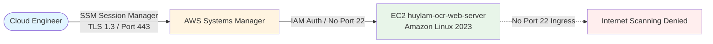

# Architecting Chained Security Groups & Eliminating SSH Port 22 on AWS: Production Lessons

> [!NOTE] Published Live on LinkedIn
> * **Author**: Lam Quang Huy (Student ID: `0212267` - Hanoi University of Civil Engineering)
> * **Program**: AWS First Cloud AI Journey (FCAJ) Bootcamp 2026
> * **LinkedIn Post Link**: [https://lnkd.in/p/giyjwMkE](https://lnkd.in/p/giyjwMkE)
> * **Project Repository**: [Lamhuy0489/aws](https://github.com/Lamhuy0489/aws)

---

## 1. Context & Cloud Security Challenges

While designing the infrastructure for my capstone project, **"Serverless Hybrid Document OCR, Parsing & Technical Translation Platform on AWS"**, a core architectural principle was ensuring internal application hosts remain completely invisible to internet port scans.

Common basic deployment pitfalls include:
1. **Exposing SSH port 22 to the public internet (`0.0.0.0/0`)** for remote administration, leading to thousands of automated brute-force attempts daily.
2. **Permitting application hosts to accept ingress directly from broad CIDR ranges** rather than exclusively from dedicated load balancers.

---

## 2. Architectural Blueprint: Defense-in-Depth Security Group Chaining

To systematically eliminate these vulnerabilities adhering to the **AWS Well-Architected Framework (Security Pillar)**, the platform implements deep network isolation:


> [!NOTE] Architecture Diagram File Formats
> * **High-Resolution Render**: `/images/architecture/aws-security-group-chaining.png` (Retina 1180x560)
> * **Scalable Vector Graphic**: `/images/architecture/aws-security-group-chaining.svg`
> * **Source Diagram File**: `/images/architecture/aws-security-group-chaining.drawio`

### 2.1. Edge Boundary: Application Load Balancer
- Security Group `huylam-alb-sg` attaches to the public ALB `huylam-ocr-alb`.
- Inbound Rules: Accepts HTTP port 80 exclusively from the public internet (`0.0.0.0/0`).
- ALB manages SSL termination, Multi-AZ routing, and filters malformed HTTP requests prior to backend forwarding.

### 2.2. Application Compute Boundary: Chained Security Group
- Amazon EC2 host `huylam-ocr-web-server` resides in a dedicated subnet attached to `huylam-web-sg`.
- Inbound Rules: Rather than allowing a CIDR block, the rule explicitly specifies the source Security Group ID:
  ```text
  Type: Custom TCP
  Port: 5000
  Source: huylam-alb-sg (sg-01a2b3c4d5e6f7g8h)
  ```
- **Operating Principle**: AWS hypervisor-level stateful firewalls drop any packets targeting EC2 port 5000 that do not originate from the ALB elastic network interfaces (ENIs), without consuming EC2 CPU cycles.

---

## 3. Zero Trust Host Administration via AWS Systems Manager

The architecture entirely deprecates SSH port 22 and eliminates bastion jump hosts:



1. **Secure Shell Access via Session Manager**: Engineers establish interactive terminal sessions over encrypted HTTPS/TLS 1.3 channels authenticated via IAM.
2. **Zero Static Credentials**: EC2 operates under IAM Instance Profile `huylam-ssm-role`. AWS STS automatically issues ephemeral tokens for S3, DynamoDB, and Parameter Store interactions.
3. **Centralized Configuration**: All application secrets and parameters are stored encrypted with AWS KMS inside AWS Systems Manager Parameter Store under `/huylam-ocr/config`.

---

## 4. Operational Takeaways

1. **100% Reduction in Administrative Attack Surface**: No management ports exposed to the public Internet.
2. **Complete Observability & Auditability**: Every session and command executed on the host is audited.
3. **Key Lesson**: Robust cloud security must be baked into the foundational network topology from day one following the Principle of Least Privilege.