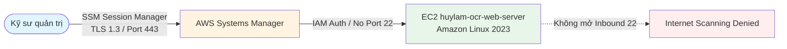

# Thiết kế chuỗi an ninh Security Group Chaining và loại bỏ hoàn toàn cổng SSH 22 trên AWS: Bài học từ dự án thực tế

> [!NOTE] Bài viết đã công bố trực tuyến trên LinkedIn
> * **Tác giả**: Lâm Quang Huy (MSSV: `0212267` - Trường Đại học Xây dựng Hà Nội)
> * **Chương trình**: AWS First Cloud AI Journey (FCAJ) Bootcamp 2026
> * **Liên kết bài đăng LinkedIn**: [https://lnkd.in/p/giyjwMkE](https://lnkd.in/p/giyjwMkE)
> * **Mã nguồn dự án**: [Lamhuy0489/aws](https://github.com/Lamhuy0489/aws)

---

## 1. Bối cảnh & Thách thức an ninh đám mây

Trong quá trình xây dựng hạ tầng cho dự án tốt nghiệp **"Serverless Hybrid Document OCR, Parsing & Technical Translation Platform on AWS"**, một trong những mục tiêu kiến trúc hàng đầu là: **Đảm bảo máy chủ ứng dụng nội bộ hoàn toàn vô hình trước các cuộc tấn công rà quét từ mạng Internet công cộng**.

Nhiều giải pháp triển khai cơ bản trên đám mây hiện nay vẫn mắc phải hai lỗ hổng kiến trúc phổ biến:
1. **Mở cổng SSH 22 ra ngoài Internet (`0.0.0.0/0`)** để quản trị máy chủ từ xa, dẫn đến việc phải đối mặt với hàng nghìn cuộc tấn công dò quét mật khẩu (brute-force) mỗi ngày.
2. **Cấu hình máy chủ ứng dụng nhận lưu lượng trực tiếp từ mọi dải IP** thay vì chỉ cho phép duy nhất bộ cân bằng tải điều phối, khiến máy chủ dễ bị tấn công từ chối dịch vụ (DDoS) hoặc khai thác lỗ hổng cấp ứng dụng.

---

## 2. Kiến trúc giải pháp: Chuỗi bảo mật phân tầng (Security Group Chaining)

Để giải quyết triệt để bài toán này theo chuẩn **AWS Well-Architected Framework (Pillar Security)**, hệ thống áp dụng mô hình bảo mật chuyên sâu nhiều lớp (Defense-in-Depth):


> [!NOTE] Định dạng tệp sơ đồ kiến trúc
> * **Ảnh kết xuất độ nét cao**: `/images/architecture/aws-security-group-chaining.png` (Chuẩn Retina 1180x560)
> * **Sơ đồ đồ họa Vector SVG**: `/images/architecture/aws-security-group-chaining.svg`
> * **Tệp thiết kế nguồn Draw.io**: `/images/architecture/aws-security-group-chaining.drawio`

### 2.1. Cấu hình tầng biên: Application Load Balancer
- Khởi tạo Security Group `huylam-alb-sg` gắn vào bộ cân bằng tải `huylam-ocr-alb`.
- Inbound Rules: Chỉ mở cổng HTTP 80 từ Internet (`0.0.0.0/0`).
- ALB chịu trách nhiệm tiếp nhận, phân phối lưu lượng Multi-AZ và lọc các kết nối bất thường trước khi chuyển tiếp vào Target Group.

### 2.2. Cấu hình tầng máy chủ nội bộ: Security Group lồng nhau
- Máy chủ Amazon EC2 `huylam-ocr-web-server` đặt tại Subnet riêng và gán Security Group `huylam-web-sg`.
- Inbound Rules: Thay vì mở cổng TCP 5000 cho một dải địa chỉ IP CIDR, cấu hình gán trực tiếp định danh nguồn (Source Security Group):
  ```text
  Type: Custom TCP
  Port: 5000
  Source: huylam-alb-sg (sg-01a2b3c4d5e6f7g8h)
  ```
- **Nguyên lý hoạt động**: Tường lửa ảo cấp hạ tầng của AWS chỉ cho phép các gói tin bắt nguồn từ chính các giao diện mạng (ENI) của `huylam-alb-sg`. Bất kỳ yêu cầu nào cố gắng gửi trực tiếp tới địa chỉ IP của máy chủ EC2 đều bị chặn ngay lập tức mà không tiêu tốn chu kỳ CPU của ứng dụng.

---

## 3. Quản trị Zero Trust không mở cổng SSH 22 với AWS Systems Manager

Hệ thống loại bỏ hoàn toàn việc duy trì cổng SSH 22 và xóa bỏ sự phụ thuộc vào máy chủ trung chuyển (Bastion Host):



1. **Quản trị an toàn qua Session Manager**: Kỹ sư kết nối trực tiếp vào console của máy chủ thông qua AWS Management Console hoặc AWS CLI bằng Session Manager qua kênh truyền HTTPS/TLS 1.3.
2. **Cơ chế xác thực không dùng khóa tĩnh (Zero Static Credentials)**: Máy chủ EC2 được gắn IAM Instance Profile mang tên `huylam-ssm-role`. Mọi tương tác tới S3, DynamoDB hay Parameter Store đều được cấp phát token tạm thời qua AWS STS (Security Token Service). Không tồn tại bất kỳ Access Key tĩnh nào trong tệp cấu hình hay mã nguồn.
3. **Quản lý cấu hình tập trung**: Toàn bộ chuỗi bí mật (Secret Key) và tham số môi trường được lưu trữ mã hóa chuẩn KMS trong AWS Systems Manager Parameter Store tại đường dẫn `/huylam-ocr/config`.

---

## 4. Kết quả thực chiến & Bài học kinh nghiệm

1. **Giảm 100% diện tích bề mặt tấn công (Attack Surface)**: Máy chủ không mở bất kỳ cổng quản trị nào ra ngoài Internet, ngăn chặn hoàn toàn nguy cơ quét cổng botnet.
2. **Khả năng quan sát toàn diện**: Mọi phiên làm việc và câu lệnh thực thi trên máy chủ đều được ghi lại nhật ký phục vụ công tác thanh tra (Audit Trail).
3. **Bài học đúc kết**: An toàn thông tin không phải là phần bổ sung sau khi xây dựng xong hệ thống, mà phải được kiến tạo ngay từ thiết kế mạng nền tảng theo nguyên tắc đặc quyền tối thiểu (Least Privilege).